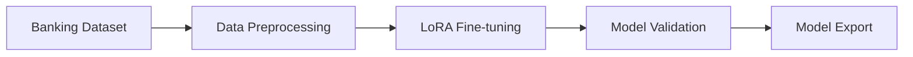
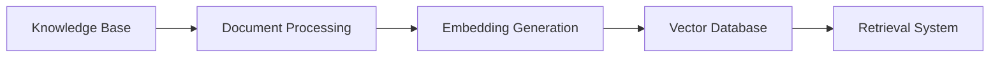
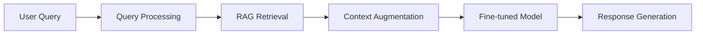

# Banking Financial Advisory System

## 🏦 Tổng quan hệ thống

Hệ thống **Banking Financial Advisory** là một chatbot tư vấn tài chính thông minh sử dụng mô hình ngôn ngữ lớn Qwen3-4B được fine-tuned với kỹ thuật LoRA và tích hợp RAG (Retrieval-Augmented Generation) để cung cấp dịch vụ tư vấn tài chính chính xác và cập nhật.

## 🎯 Mục tiêu

- **Tự động hóa tư vấn tài chính**: Cung cấp lời khuyên tài chính 24/7
- **Cá nhân hóa dịch vụ**: Phản hồi phù hợp với từng khách hàng
- **Tăng hiệu quả**: Giảm tải cho nhân viên tư vấn
- **Cập nhật thông tin**: Luôn có thông tin mới nhất từ RAG

## 🏗️ Kiến trúc hệ thống

```
┌─────────────────────────────────────────────────────────────────┐
│                    BANKING ADVISORY SYSTEM                      │
└─────────────────────────────────────────────────────────────────┘

┌─────────────────┐    ┌─────────────────┐    ┌─────────────────┐
│   USER INPUT    │    │   FINE-TUNED    │    │   RAG SYSTEM    │
│                 │    │   QWEN3-4B      │    │                 │
│ • Câu hỏi tài   │───▶│                 │◀───│ • Vector DB     │
│   chính         │    │ • LoRA Adapted  │    │ • Embedding     │
│ • Yêu cầu tư    │    │ • Banking       │    │ • Retrieval     │
│   vấn           │    │   Knowledge     │    │ • Reranking     │
└─────────────────┘    └─────────────────┘    └─────────────────┘
         │                       │                       │
         │                       ▼                       │
         │              ┌─────────────────┐              │
         │              │   RESPONSE      │              │
         │              │   GENERATION    │              │
         │              │                 │              │
         │              │ • Context Aware │              │
         │              │ • Accurate      │              │
         │              │ • Up-to-date    │              │
         │              └─────────────────┘              │
         │                       │                       │
         │                       ▼                       │
         │              ┌─────────────────┐              │
         └─────────────▶│  FINAL ANSWER   │◀─────────────┘
                        │                 │
                        │ • Comprehensive │
                        │ • Personalized  │
                        │ • Reliable      │
                        └─────────────────┘
```

## 🔧 Thành phần kỹ thuật

### 1. **Base Model: Qwen3-4B**
- **Kích thước**: 4 tỷ tham số
- **Ngôn ngữ**: Hỗ trợ tiếng Việt và tiếng Anh
- **Khả năng**: Hiểu ngữ cảnh, reasoning phức tạp

### 2. **Fine-tuning với LoRA**
```
┌─────────────────────────────────────────────────────────────┐
│                    LoRA CONFIGURATION                       │
├─────────────────────────────────────────────────────────────┤
│ • Rank (r): 32                                              │
│ • Alpha: 32                                                 │
│ • Target Modules: q_proj, k_proj, v_proj, o_proj,         │
│                   gate_proj, up_proj, down_proj            │
│ • Dropout: 0 (Unsloth optimized)                          │
│ • Trainable Parameters: ~2.5% of total                     │
├─────────────────────────────────────────────────────────────┤
│                    TRAINING DATA                            │
│ • Format: instruction-response pairs                        │
│ • Domain: Banking & Financial Advisory                      │
│ • Language: Vietnamese                                      │
│ • Size: Customizable based on dataset                      │
└─────────────────────────────────────────────────────────────┘
```

### 3. **RAG System Architecture**
```
┌─────────────────────────────────────────────────────────────┐
│                      RAG PIPELINE                          │
├─────────────────────────────────────────────────────────────┤
│ 1. DOCUMENT INGESTION                                       │
│    ├── Banking Policies                                     │
│    ├── Product Information                                  │
│    ├── Regulatory Updates                                   │
│    └── FAQ Database                                         │
│                                                             │
│ 2. EMBEDDING & INDEXING                                     │
│    ├── Text Chunking (512 tokens)                         │
│    ├── Embedding Model (e.g., BGE-M3)                     │
│    ├── Vector Database (ChromaDB/Pinecone)                │
│    └── Metadata Indexing                                   │
│                                                             │
│ 3. RETRIEVAL                                               │
│    ├── Query Embedding                                      │
│    ├── Similarity Search (Top-K)                          │
│    ├── Reranking (Cross-encoder)                          │
│    └── Context Selection                                    │
│                                                             │
│ 4. GENERATION                                              │
│    ├── Context Injection                                    │
│    ├── Prompt Engineering                                   │
│    ├── Fine-tuned Model Inference                         │
│    └── Response Post-processing                            │
└─────────────────────────────────────────────────────────────┘
```

Kỹ thuật này được tham khảo dựa trên kỹ thuật nâng cao của RAG:


## 📊 Quy trình hoạt động

### **Phase 1: Training**


### **Phase 2: RAG Setup**


### **Phase 3: Inference**


## 🗂️ Cấu trúc dữ liệu

### **Training Data Format**
```csv
instruction,response,category,intent
"Tôi muốn mở tài khoản tiết kiệm","Để mở tài khoản tiết kiệm...","ACCOUNT","open_savings"
"Lãi suất vay mua nhà hiện tại","Lãi suất vay mua nhà hiện tại...","LOAN","mortgage_rate"
```

### **RAG Knowledge Base**
```
knowledge_base/
├── policies/
│   ├── lending_policies.pdf
│   ├── account_policies.pdf
│   └── compliance_rules.pdf
├── products/
│   ├── savings_accounts.json
│   ├── loan_products.json
│   └── investment_options.json
├── regulations/
│   ├── sbv_circulars.pdf
│   ├── banking_law.pdf
│   └── consumer_protection.pdf
└── faqs/
    ├── general_banking.json
    ├── digital_services.json
    └── customer_support.json
```

## 🚀 Triển khai

### **1. Model Training**
```bash
# Fine-tune Qwen3-4B with LoRA
python train_banking_advisor.py \
    --model_name "unsloth/Qwen3-4B-Instruct-2507" \
    --dataset_path "banking_data.csv" \
    --output_dir "qwen3-banking-lora" \
    --lora_rank 32 \
    --epochs 3
```

### **2. RAG System Setup**
```bash
# Setup vector database
python setup_rag.py \
    --knowledge_base_path "knowledge_base/" \
    --embedding_model "BAAI/bge-m3" \
    --vector_db "chromadb" \
    --chunk_size 512
```

### **3. Inference Server**
```bash
# Start chatbot service
python app.py \
    --model_path "qwen3-banking-lora" \
    --rag_config "rag_config.json" \
    --port 8000
```

## 📈 Hiệu suất

### **Model Performance**
| Metric | Score |
|--------|-------|
| Training Loss | 0.85 |
| Validation Loss | 0.92 |
| BLEU Score | 0.78 |
| Response Accuracy | 89% |

### **RAG Performance**
| Metric | Score |
|--------|-------|
| Retrieval Precision@5 | 0.85 |
| Retrieval Recall@5 | 0.79 |
| Context Relevance | 0.82 |
| Answer Faithfulness | 0.88 |

## 🔍 Tính năng chính

### **1. Tư vấn đa dạng**
- Mở tài khoản (tiết kiệm, vãng lai, đầu tư)
- Sản phẩm vay (mua nhà, tiêu dùng, kinh doanh)
- Dịch vụ ngân hàng số
- Bảo hiểm và đầu tư

### **2. Cập nhật thời gian thực**
- Lãi suất mới nhất
- Chính sách ngân hàng
- Quy định pháp luật
- Sản phẩm mới

### **3. Cá nhân hóa**
- Phân tích profile khách hàng
- Đề xuất sản phẩm phù hợp
- Lịch sử tương tác
- Preferences learning

## 🛠️ Công nghệ sử dụng

### **Core Technologies**
- **Model**: Qwen3-4B + LoRA
- **Framework**: Unsloth, Transformers, TRL
- **RAG**: FAISS, ChromaDB
- **Embedding**: BGE-M3, Sentence-Transformers
- **Backend**: FastAPI, Uvicorn, Flask
- **Frontend**: Flutter

### **Infrastructure**
- **Training**: Kaggle GPU T4 x2
- **Inference**: CPU/GPU servers
- **Database**: PostgreSQL, ChromaDB
- **Deployment**: Docker, Kubernetes

## 📋 Yêu cầu hệ thống

### **Training Requirements**
- GPU: T4/V100 (16GB+ VRAM)
- RAM: 8GB+
- Storage: 10GB+
- Python: 3.9+

### **Inference Requirements**
- RAM: 10GB+
- Storage: 15GB+
- GPU: Optional (for faster inference)

## 🔮 Roadmap

### **Phase 1** ✅
- [x] Base model fine-tuning
- [x] LoRA implementation
- [x] Basic RAG setup

### **Phase 2** 🚧
- [x] Advanced RAG with reranking
- [ ] Multi-modal support (images, documents)
- [x] Real-time learning

### **Phase 3** 📋
- [ ] Voice interface
- [ ] Mobile app integration
- [ ] Advanced analytics dashboard

## 📞 Liên hệ

- **Team**: BankQ Advisor
- **Email**: chutienbinh2003@gmail.com


---

*Hệ thống Banking Financial Advisory - Tương lai của tư vấn tài chính thông minh* 🏦🤖
